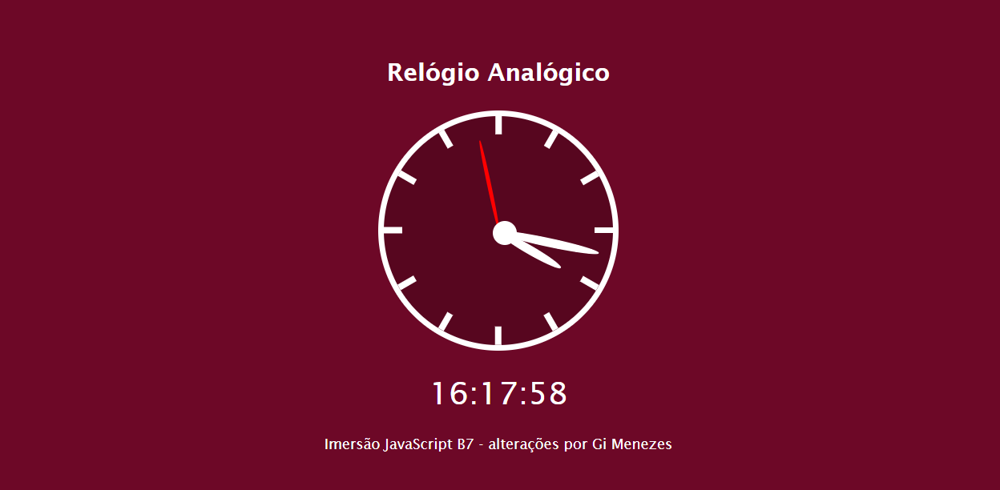

<h1 align="center">Projeto 2 : Relógio Analógico</h1>



<p align="center">
  <a href="#dart-sobre">Sobre</a> &#xa0; | &#xa0; 
  <a href="#rocket-tecnologias">Tecnologias</a> &#xa0; | &#xa0;
  <a href="#white_check_mark-pré-requesitos">Pré requisitos</a> &#xa0; | &#xa0;
  <a href="#checkered_flag-começando">Começando</a> &#xa0; | &#xa0;
  <a href="#memo-licença">Licença</a> &#xa0; | &#xa0;
  <a href="https://github.com/gsmenezes" target="_blank">Autor</a>
</p>

<br>

## :dart: Sobre ##

O projeto faz parte do Desafio 7 projetos em JavaScript em 7 dias, idealizado por [Bonieky Lacerda](https://github.com/bonieky).
O 2º consiste em um relógio analógico, atualizado em tempo real, de segundo a segundo.


## :rocket: Tecnologias ##

As seguintes ferramentas foram usadas na construção do projeto:

- HTML
- CSS
- [JavaScript](https://www.javascript.com/)

## :white_check_mark: Pré requisitos ##

Antes de começar :checkered_flag:, você precisa ter o [Git](https://git-scm.com) instalado em sua máquina.

## :checkered_flag: Começando ##

```bash
# Clone este repositório
$ git clone https://github.com/gsmenezes/js-clock

# Entre na pasta
$ cd js-clock

# Clique com o botão direito no arquivo index.html

# Abra com o Live Server

# O app vai inicializar em <http://127.0.0.1:5500/index.html>
```

## :memo: Licença ##

Este projeto está sob licença MIT. Veja o arquivo [LICENSE](LICENSE.md) para mais detalhes.

<p align="center">
Feito com :heart: por <a href="https://github.com/gsmenezes" target="_blank">gi menezes</a>
</p>

